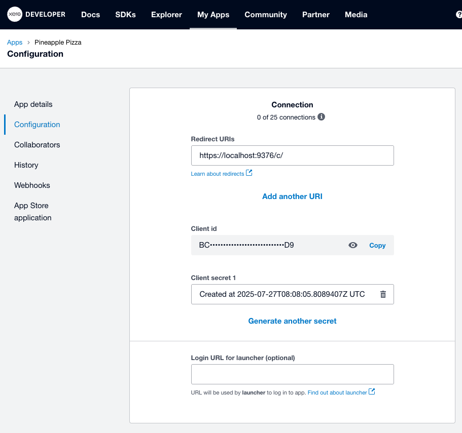
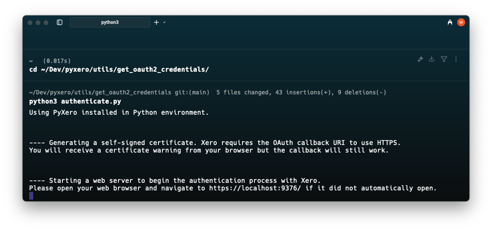
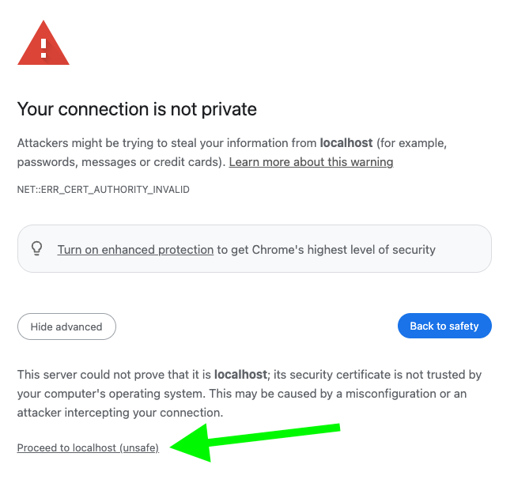
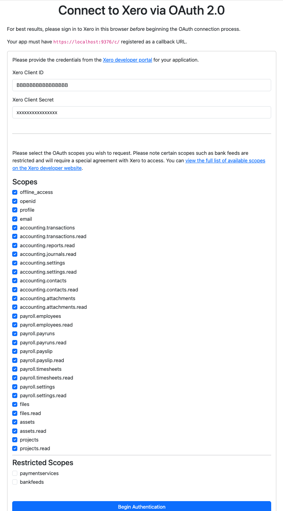
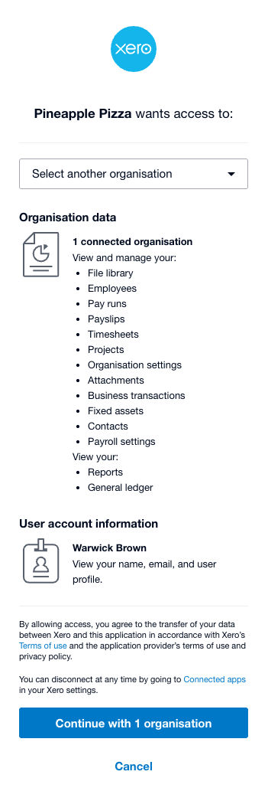
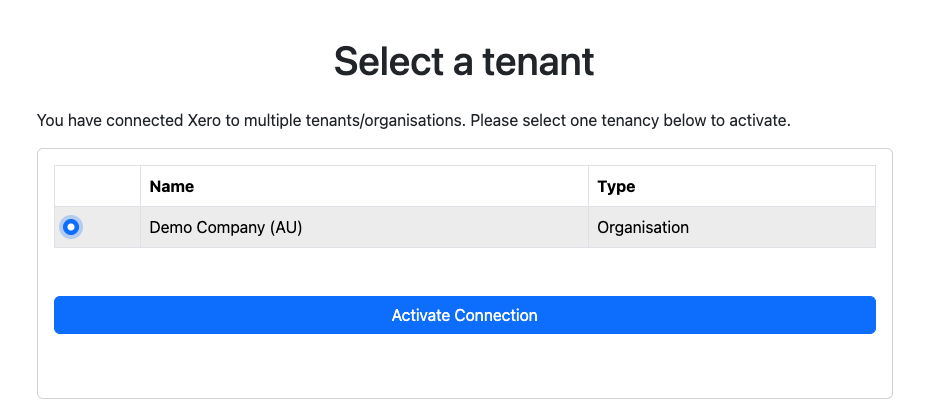
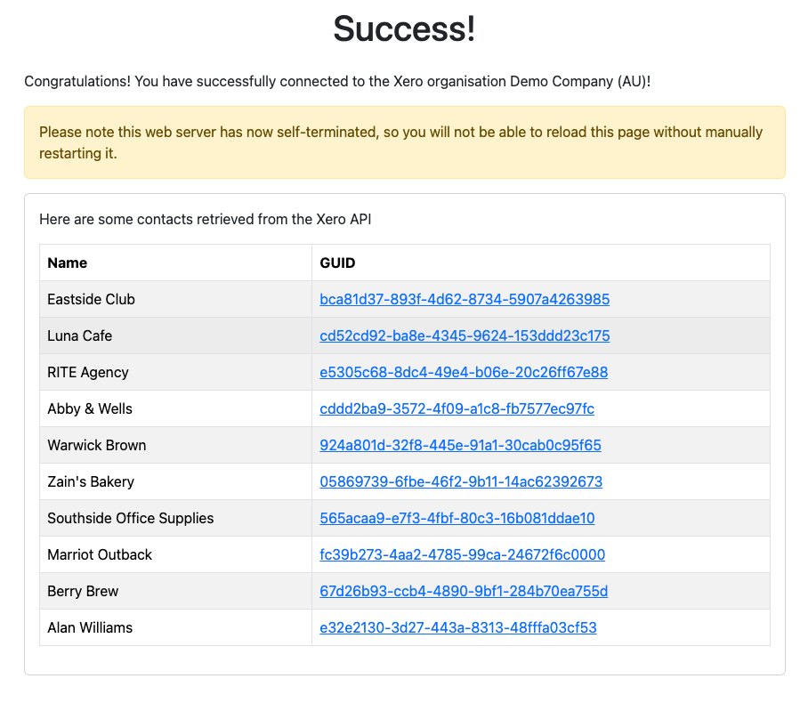
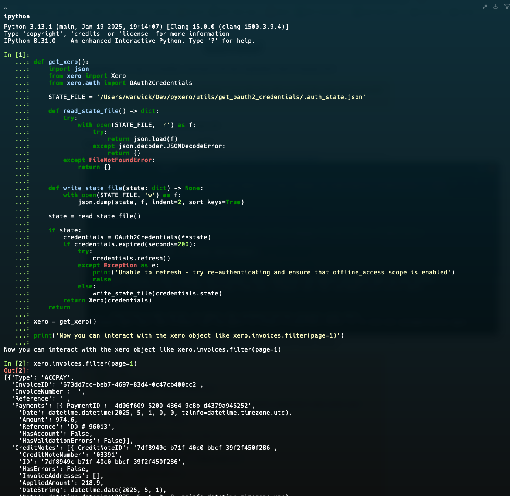

# PyXero OAuth 2.0 Credential Generator

This is a tool designed for __local development use only__ to assist
contributors to the PyXero package in generating OAuth 2.0 credentials
to access the Xero API.

This is _not_ designed for production use.

This has only been tested on macOS so far.
I expect Linux works fine, but have no idea about Windows.

## Usage

1) Either install PyXero into your Python environment, or install all the supporting packages
   required by it as defined in the project's `pyproject.toml` file. In the event that you do
   _not_ install PyXero (such as working on it), this tool will import it from the source files
   instead of from the Python environment.

2) If you have not already, [register an app in the Xero developer portal](https://developer.xero.com/app/manage/)
   and be sure to add `https://localhost:9376/c/ ` as a redirect URI. Copy and retain the provided client ID
   and client secret, as you will need these to generate an OAuth token.

3) Navigate to the folder containing this document in your terminal and run `python3 authenticate.py`

4) Your web browser should automatically open. If it does not, the script terminal will
   display the URL to open (usually `https://localhost:9376/`). A self-signed TLS certificate
   will be generated for you, as Xero requires the callback process to be done via HTTPS.

5) Ignore the certificate warnings from your browser. This is expected behaviour as the certificates are
   self-signed for local development purposes. Any use of PyXero in production should be done using third-party
   certificates.

6) Enter your Xero client ID and client secret, and select all the scopes you wish to authenticate for,
   then click _Begin Authentication_.

   Note that the "restricted" scopes require a specialised agreement with Xero, and requesting them without
   such an agreement in place will prevent you from authenticating.

   Also note that if you do not select "offline_access" you may be unable to generate any tokens.

7) You should now be redirected to Xero. Sign in if you have not already, then select the organisation
   that you wish to authenticate against.

8) If you have authorised against multiple organisations, you will be asked to select a tenant to use.
   You can change the selected tenant later, but this is required to actually retrieve data from Xero.

9) Assuming everything worked, you will be presented with a list of 10 contacts retrieved from the Xero
   API for the selected organisation.

10) You should also be provided with a code block that you can copy and paste into an interactive Python
    session to begin interacting with the Xero API.

